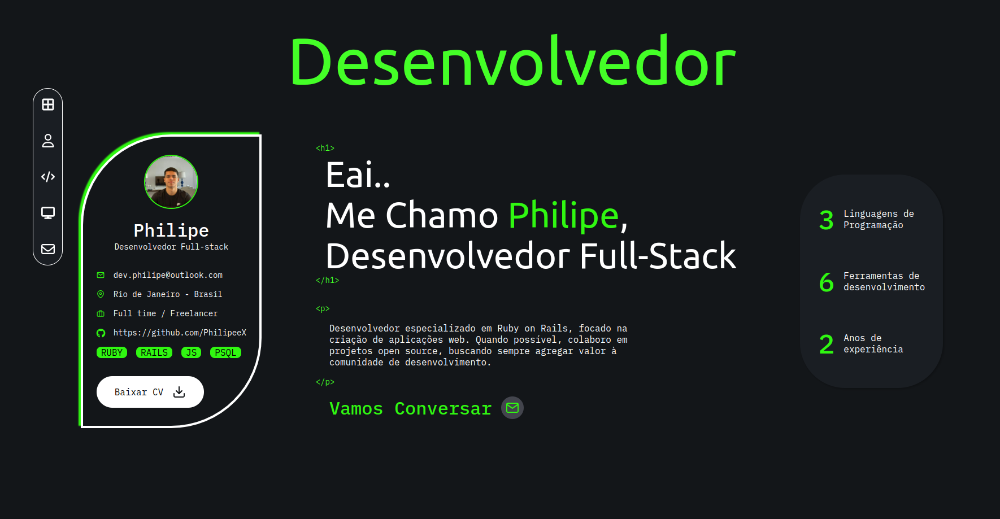

# Bem vindo ao Meu Portfólio

> Meu portfólio foi criado e está sendo desenvolvido com carinho para mostrar projetos que moldaram minha jornada profissional. De projetos open-source voluntários a trabalhos freelancers, e até mesmo criações inspiradas pelo puro prazer, cada página revela uma história única.

## Technologies
* Ruby 3.1.2
* Rails 7.0.8
* PostgreSQL

## Link de deploy
Acesse em: Em breve...
##
Author: <strong>Philipe Rodrigues (dev.philipe@outlook.com)</strong>

<a href="#topo-readme">Voltar ao topo</a>

